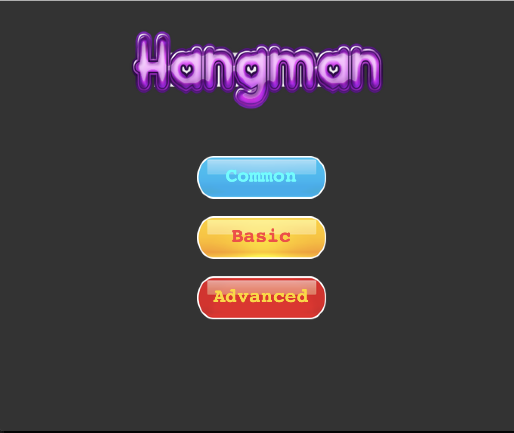
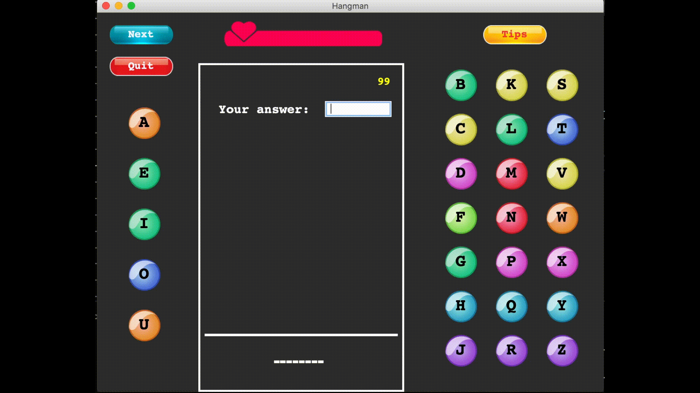

# Hangman

### This game is to help students who are preparing for GRE test to learn and improve vocabulary.

## 1. Choose a level 

## 2. Look up tips
* Click **`Tips`** to see definition of the word.

## 3. Take a guess
* Click letter buttons or type to take a guess.
* Getting consecutively correct answers will be rewarded with more points.

## 4. Health bar
* Users have 5 lives each round.
* The game ends when the health bar drops to zero.

## 5. Skip a round
* Click **`Next`** to skip this word.
* Skipping will cost the user one life.

## 6. Quit the game
* Click **`Quit`** to exit the game.

#### * All credit goes to Magoosh for vocabulary and definitions.
